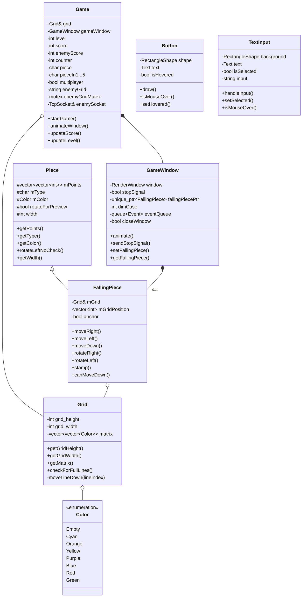

# Diagramme des classes du projet

```mermaid
classDiagram
    class Color {
        <<enumeration>>
        Empty
        Cyan
        Orange
        Yellow
        Purple
        Blue
        Red
        Green
    }

    class Grid {
        -int grid_height
        -int grid_width
        -vector~vector~Color~~ matrix
        +getGridHeight()
        +getGridWidth()
        +getMatrix()
        +checkForFullLines()
        -moveLineDown(lineIndex)
    }

    class Piece {
        #vector~vector~int~~ mPoints
        #char mType
        #Color mColor
        #bool rotateForPreview
        #int width
        +getPoints()
        +getType()
        +getColor()
        +rotateLeftNoCheck()
        +getWidth()
    }

    class FallingPiece {
        -Grid& mGrid
        -vector~int~ mGridPosition
        -bool anchor
        +moveRight()
        +moveLeft()
        +moveDown()
        +rotateRight()
        +rotateLeft()
        +stamp()
        +canMoveDown()
    }

    class Game {
        -Grid& grid
        -GameWindow gameWindow
        -int level
        -int score
        -int enemyScore
        -int counter
        -char piece
        -char pieceIn1...5
        -bool multiplayer
        -string enemyGrid
        -mutex enemyGridMutex
        -TcpSocket& enemySocket
        +startGame()
        +animateWindow()
        +updateScore()
        +updateLevel()
    }

    class GameWindow {
        -RenderWindow window
        -bool stopSignal
        -unique_ptr~FallingPiece~ fallingPiecePtr
        -int dimCase
        -queue~Event~ eventQueue
        -bool closeWindow
        +animate()
        +sendStopSignal()
        +setFallingPiece()
        +getFallingPiece()
    }

    class Button {
        -RectangleShape shape
        -Text text
        -bool isHovered
        +draw()
        +isMouseOver()
        +setHovered()
    }

    class TextInput {
        -RectangleShape background
        -Text text
        -bool isSelected
        -string input
        +handleInput()
        +setSelected()
        +isMouseOver()
    }

    Piece <|-- FallingPiece
    Game *-- GameWindow
    Game o-- Grid
    FallingPiece o-- Grid
    GameWindow *-- "0..1" FallingPiece
    Grid o-- Color
```